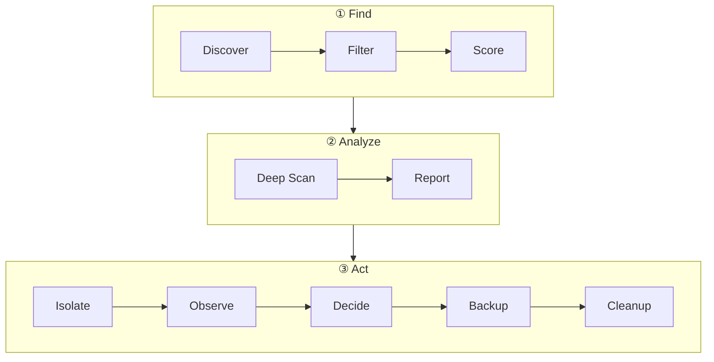

# Open DevOps Skills

Production-ready DevOps & SRE skills for [Claude Code](https://claude.ai/code) and [Codex CLI](https://github.com/openai/codex).

## ICO — Infra Cost Optimizer

Find idle and underutilized cloud resources, safely isolate and observe them, and decommission the real zombies — reducing cloud spend without breaking production.



### Key Capabilities

**Multi-cloud Idle Detection** — Scan 10+ resource types across any cloud provider. Per-type signals: CPU/network/login for compute, connections/QPS for databases, IOPS/throughput for storage, replica status for Kubernetes workloads. No vendor lock-in — works with any cloud API or plain SSH.

**Deep Technical Profiling** — SSH into candidate resources to capture real-time traffic topology graphs, running services, cron jobs, disk usage, and business ownership from cloud tags, CMDB, and audit logs.

**Safe Isolation & Auto-Rollback** — Type-specific isolation methods (iptables, security groups, scale-to-zero). Environment-appropriate observation periods with anomaly detection. Automatic rollback on critical alerts.

**Pre-deletion Safety** — Per-resource-type backups with encryption for sensitive data. Seven-point re-evaluation before any destructive action. Human approval required at every critical gate.

**Interactive Reports & Cost Tracking** — Self-contained HTML reports with per-resource service topology graphs, process tables, storage usage, and cost savings analysis. Full audit trail for every action.

### See It in Action


## Quick Start

### Installation

```bash
# Claude Code
claude plugin install ./plugins/ico

# Or via marketplace
claude plugin marketplace add https://github.com/KnoxOps/open-devops-skills
claude plugin install ico@open-devops-skills

# Codex CLI
codex plugin marketplace add https://github.com/KnoxOps/open-devops-skills
codex plugin add ico@open-devops-skills
```

### Try It

Once installed, ask Claude Code or Codex:

- `/ico:orchestrator Scan my cloud account for idle and underutilized resources`
- `/ico:orchestrator Deep scan 3 hosts and show traffic topology`
- `/ico:orchestrator Which resources can I safely downsize or decommission?`

## Roadmap

We plan to grow this into a full SRE skill library. Vote or contribute to shape what comes next.

| Area | Ideas |
|------|-------|
| **Cost Optimization** | Reserved Instance analysis, Savings Plan audit, spot instance recommendations |
| **Kubernetes** | Pod troubleshooting, OOM diagnosis, cluster right-sizing, orphaned resource detection |
| **Security** | Secret sprawl detection, IAM permission audit, exposed resource scanning |
| **Monitoring** | Coverage gap analysis, alert noise reduction, dashboard health scoring |

→ [Vote for what you want next](https://github.com/KnoxOps/open-devops-skills/issues)

## Contributing

Skills are organized as plugins under `plugins/<namespace>/`. Each plugin has unified Claude Code and Codex manifests plus a set of runbook-defined skills.

1. Fork the repo
2. Create `plugins/<your-plugin>/` with `.claude-plugin/plugin.json` and `.codex-plugin/plugin.json`
3. Define skills as `agent-runbooks/<skill>/runbook.yaml`
4. Run `python scripts/gen-skill plugins/<your-plugin>/agent-runbooks/<skill>/runbook.yaml --lang en`
5. Add your plugin to `.claude-plugin/marketplace.json`
6. Open a PR

## License

[Apache 2.0](LICENSE)

---

*Built with [agent-runbook](https://github.com/KnoxOps/agent-runbook). Maintained by [KnoxOps](https://knoxops.app?invite_token=GITHUB26).*
